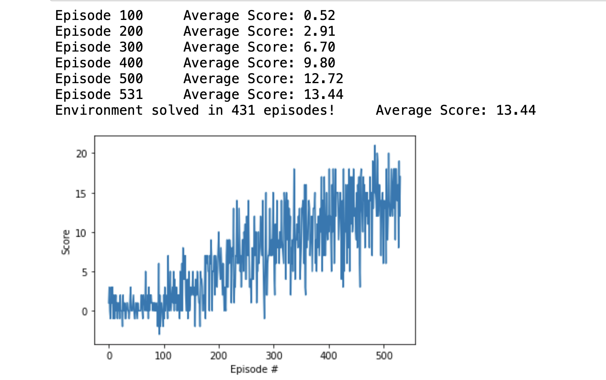
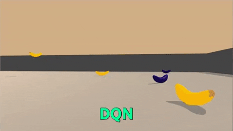
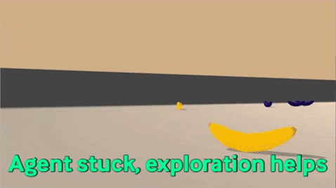
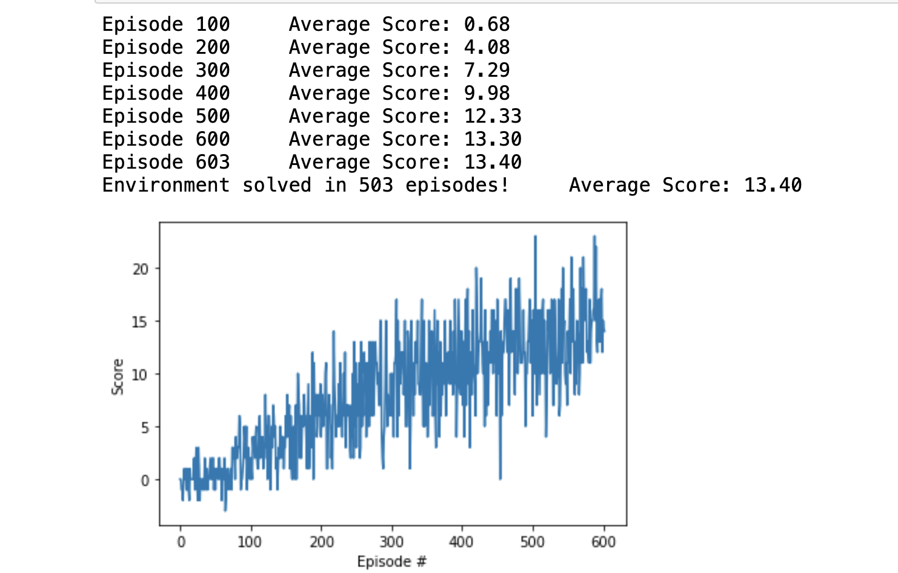
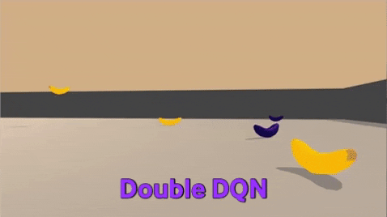

[//]: # (Image References)

[image1]: https://user-images.githubusercontent.com/10624937/42135619-d90f2f28-7d12-11e8-8823-82b970a54d7e.gif "Trained Agent"

# Project 1: Navigation

### Introduction

For this project, you will train an agent to navigate (and collect bananas!) in a large, square world.  

![Trained Agent][image1]

A reward of +1 is provided for collecting a yellow banana, and a reward of -1 is provided for collecting a blue banana.  Thus, the goal of your agent is to collect as many yellow bananas as possible while avoiding blue bananas.  

The state space has 37 dimensions and contains the agent's velocity, along with ray-based perception of objects around agent's forward direction.  Given this information, the agent has to learn how to best select actions.  Four discrete actions are available, corresponding to:
- **`0`** - move forward.
- **`1`** - move backward.
- **`2`** - turn left.
- **`3`** - turn right.

The task is episodic, and in order to solve the environment, your agent must get an average score of +13 over 100 consecutive episodes.

### Getting Started

1. Download the environment from one of the links below.  You need only select the environment that matches your operating system:
    - Linux: [click here](https://s3-us-west-1.amazonaws.com/udacity-drlnd/P1/Banana/Banana_Linux.zip)
    - Mac OSX: [click here](https://s3-us-west-1.amazonaws.com/udacity-drlnd/P1/Banana/Banana.app.zip)
    - Windows (32-bit): [click here](https://s3-us-west-1.amazonaws.com/udacity-drlnd/P1/Banana/Banana_Windows_x86.zip)
    - Windows (64-bit): [click here](https://s3-us-west-1.amazonaws.com/udacity-drlnd/P1/Banana/Banana_Windows_x86_64.zip)
    
    (_For Windows users_) Check out [this link](https://support.microsoft.com/en-us/help/827218/how-to-determine-whether-a-computer-is-running-a-32-bit-version-or-64) if you need help with determining if your computer is running a 32-bit version or 64-bit version of the Windows operating system.

    (_For AWS_) If you'd like to train the agent on AWS (and have not [enabled a virtual screen](https://github.com/Unity-Technologies/ml-agents/blob/master/docs/Training-on-Amazon-Web-Service.md)), then please use [this link](https://s3-us-west-1.amazonaws.com/udacity-drlnd/P1/Banana/Banana_Linux_NoVis.zip) to obtain the environment.

2. Place the file in the DRLND GitHub repository, in the `p1_navigation/` folder, and unzip (or decompress) the file. 

### Instructions

Follow the instructions in `Navigation.ipynb` to get started with training your own agent!  

### (Optional) Challenge: Learning from Pixels

After you have successfully completed the project, if you're looking for an additional challenge, you have come to the right place!  In the project, your agent learned from information such as its velocity, along with ray-based perception of objects around its forward direction. A more challenging task would be to learn directly from pixels!

To solve this harder task, you'll need to download a new Unity environment.  This environment is almost identical to the project environment, where the only difference is that the state is an 84 x 84 RGB image, corresponding to the agent's first-person view.  (**Note**: Udacity students should not submit a project with this new environment.)

You need only select the environment that matches your operating system:
- Linux: [click here](https://s3-us-west-1.amazonaws.com/udacity-drlnd/P1/Banana/VisualBanana_Linux.zip)
- Mac OSX: [click here](https://s3-us-west-1.amazonaws.com/udacity-drlnd/P1/Banana/VisualBanana.app.zip)
- Windows (32-bit): [click here](https://s3-us-west-1.amazonaws.com/udacity-drlnd/P1/Banana/VisualBanana_Windows_x86.zip)
- Windows (64-bit): [click here](https://s3-us-west-1.amazonaws.com/udacity-drlnd/P1/Banana/VisualBanana_Windows_x86_64.zip)

Then, place the file in the `p1_navigation/` folder in the DRLND GitHub repository, and unzip (or decompress) the file.  Next, open `Navigation_Pixels.ipynb` and follow the instructions to learn how to use the Python API to control the agent.

(_For AWS_) If you'd like to train the agent on AWS, you must follow the instructions to [set up X Server](https://github.com/Unity-Technologies/ml-agents/blob/master/docs/Training-on-Amazon-Web-Service.md), and then download the environment for the **Linux** operating system above.

### Algorithm 

The chosen environment to work on this project was the one where the agent learns from ray-based perception of objects around its forward direction. 

In order to allow the agent to learn, I coded two algorithms:
* DQN
* Double DQN

#### Encironment Setup
* Banana.app
* Number of agents: 1
* Number of actions: 4
* States have length: 37

#### DQN 

Deep Q-Learning algorithm represents the optimal action-value function $q_*$ as a neural network (instead of a table).

Deep Q-Learning algorithm, which addressed the instabilities of learning an action from a neural network by using:

* Experience Replay
* Fixed Q-Targets

DeepMind leveraged a Deep Q-Network (DQN) to build the Deep Q-Learning algorithm that learned to play many Atari video games better than humans.

* In order to capture temporal information, a stack of 4 preprocessed frames are used as the state that is passed to the DQN.
* The DQN takes the state as input, and returns the corresponding predicted action values for each possible game action.
* The DQN architecture is composed of a couple of convolutional layers, followed by a couple of fully connected layers.
* For each Atari game, the DQN was trained from scratch on that game.

In this case our state or observation space is a vector of 37 dimensions, so, I will use fully connected neural networks as model.

```
class QNetwork(nn.Module):
    """Actor (Policy) Model."""

    def __init__(self, state_size, action_size, seed, fc1_units=64, fc2_units=64):
        """Initialize parameters and build model.
        Params
        ======
            state_size (int): Dimension of each state
            action_size (int): Dimension of each action
            seed (int): Random seed
            fc1_units (int): Number of nodes in first hidden layer
            fc2_units (int): Number of nodes in second hidden layer
        """
        super(QNetwork, self).__init__()
        self.seed = torch.manual_seed(seed)
        self.fc1 = nn.Linear(state_size, fc1_units)
        self.fc2 = nn.Linear(fc1_units, fc2_units)
        self.fc3 = nn.Linear(fc2_units, action_size)

    def forward(self, state):
        """Build a network that maps state -> action values."""
        x = F.relu(self.fc1(state))
        x = F.relu(self.fc2(x))
        return self.fc3(x)
```
This model will be the base for the target and local network of the DQN algorithm.

The target and local network maps the state and action onto a value.


##### Expericence Replay

When the agent interacts with the environment, the sequence of experience tuples can be highly correlated. The naive Q-learning algorithm that learns from each of these experience tuples in sequential order runs the risk of getting swayed by the effects of this correlation. By instead keeping track of a replay buffer and using experience replay to sample from the buffer at random, we can prevent action values from oscillating or diverging catastrophically.

The replay buffer contains a collection of experience tuples ($S$, $A$, $R$, $S'$). 

The tuples are gradually added to the buffer as we are interacting with the environment.

The act of sampling a small batch of tuples from the replay buffer in order to learn is known as experience replay. In addition to breaking harmful correlations, experience replay allows us to learn more from individual tuples multiple times, recall rare occurrences, and in general make better use of our experience.

##### Fixed Targets 

In Q-Learning, we update a guess with a guess, and this can potentially lead to harmful correlations. To avoid this, we can update the parameters $w$ in the network $\hat{q}$ to better approximate the action value corresponding to state $$ and action $A$ with the following update rule:

$\Delta w = \alpha \cdot \overbrace{( \underbrace{R + \gamma \max_a\hat{q}(S', a, w^-)}_{\rm {TD~target}} - \underbrace{\hat{q}(S, A, w)}_{\rm {old~value}})}^{\rm {TD~error}} \nabla_w\hat{q}(S, A, w)$

where $w^-$ are the weights of a separate target network that are not changed during the learning step, and ($S$, $A$, $R$, $S'$) is an experience tuple.

##### Pseudocode
The pseudocode of the DQN algorithm published in the Human-Level Control Through Deep Reinforcement Learning by Mnih and others has the following steps:

1. Initialize parameters for $q(s,a)$ and $\hat{q}(s, a)$.

2. Select a random action $a$ with probability $\epsilon$, otherwise $a = arg max_a q_{s,a}$. 

3. The agent interacts with the environment taking action $a$ and the reward $r$ and the next state $s'$ are observed. 

4. The tuple of the transition $(S, A, R, S')$ is stores in the replay buffer.

5. From the replay buffer, sample a random batch of transitions.

6. Calculate $y = r + \gamma max_{a' \in A}\hat{q}_{s',a'}$. If the episode has ended, calculate $y = r$

7. Calculate the loss $\mathcal{L} = (q_{s,a} - y)^2, the mean square error$ 

8. Minimize loss in the network weights.

9. Make a soft update of the weights from local network $q$ to target network $\hat{q}$

10. Repeat from step 2 until convergence.

```
states, actions, rewards, next_states, dones = experiences

# Get max predicted Q values (for next states) from target model
Q_targets_next = self.qnetwork_target(next_states).detach().max(1)[0].unsqueeze(1)
# Compute Q targets for current states 
Q_targets = rewards + (gamma * Q_targets_next * (1 - dones))

# Get expected Q values from local model
Q_expected = self.qnetwork_local(states).gather(1, actions)

# Compute loss
loss = F.mse_loss(Q_expected, Q_targets)
# Minimize the loss
self.optimizer.zero_grad()
loss.backward()
self.optimizer.step()

# ------------------- update target network ------------------- #
self.soft_update(self.qnetwork_local, self.qnetwork_target, TAU)
```

#### Double DQN

Several improvements to the original Deep Q-Learning algorithm have been suggested. One of them is the Doble DQN.

In the max operation is necesary to find the best possible value we could get from the next state.

The accuracy of our Q-values depends a lot on what actions have been tried, and what neighboring states have been explored. In fact, it has been shown that this results in an overestimation of Q-values, since we always pick the maximum among a set of noisy numbers. 

Double Q-Learning is basically like having two separate function approximators that must agree on the best action. If we picks an action that is not the best according to w', then the Q-value return is not that high. In the long run, this prevents the algorithm from propagating incidental high rewards that may have been obtained by chance, and don't reflect long-term returns. 

##### Pseudocode

1. Initialize parameters for $q(s,a)$ and $\hat{q}(s, a)$.

2. Select a random action $a$ with probability $\epsilon$, otherwise $a = arg max_a q_{s,a}$. 

3. The agent interacts with the environment taking action $a$ and the reward $r$ and the next state $s'$ are observed. 

4. The tuple of the transition $(S, A, R, S')$ is stores in the replay buffer.

5. From the replay buffer, sample a random batch of transitions.

6. Calculate $y = r + \gamma\hat{q}(s', arg max_aq(s',a))$. If the episode has ended, calculate $y = r$

7. Calculate the loss $\mathcal{L} = (q_{s,a} - y)^2, the mean square error$ 

8. Minimize loss in the network weights.

9. Make a soft update of the weights from local network $q$ to target network $\hat{q}$

10. Repeat from step 2 until convergence.

```
states, actions, rewards, next_states, dones = experiences

# Get argmax predicted Q values (for next states) from local model
argmax_local_actions = self.qnetwork_local(next_states).detach().argmax(1).unsqueeze(1)

Q_targets_next = self.qnetwork_target(next_states).gather(1, argmax_local_actions)

# Compute Q targets for current states 
Q_targets = rewards + (gamma * Q_targets_next * (1 - dones))

# Get expected Q values from local model
Q_expected = self.qnetwork_local(states).gather(1, actions)

# Compute loss
loss = F.mse_loss(Q_expected, Q_targets)
# Minimize the loss
self.optimizer.zero_grad()
loss.backward()
self.optimizer.step()

# ------------------- update target network ------------------- #
self.soft_update(self.qnetwork_local, self.qnetwork_target, TAU)

```

### Results
#### DQN

The hyperparameters of the training stage are:

```
BUFFER_SIZE = int(1e5)  # replay buffer size
BATCH_SIZE = 64         # minibatch size
GAMMA = 0.99            # discount factor
TAU = 1e-3              # for soft update of target parameters
LR = 5e-4               # learning rate 
UPDATE_EVERY = 4        # how often to update the network
```

To train the agent, run the cells in section 4 of the [Navigation notebook](./Navigation.ipynb).

* The environment was solved in 431 episodes
* The average score was 13.44.




To evaluate the agent in the environment, run the cells in section 5 of the [Navigation notebook](./Navigation.ipynb).



* The score of the evaluation of this episode was 16. 

One drawback is that the agent can get stuck at certain states. This shows that exploration is very important. To favor exploration, the parameter epsilon when selecting an action should be set to small quantity. This means that the agent will follow the policy the mayority of the time and rarely will take a random action. For this reason, I set the parameter epsilon to 0.01.




#### Double DQN

The hyperparameters of the training stage are:

```
BUFFER_SIZE = int(1e5)  # replay buffer size
BATCH_SIZE = 64         # minibatch size
GAMMA = 0.99            # discount factor
TAU = 1e-3              # for soft update of target parameters
LR = 5e-4               # learning rate 
UPDATE_EVERY = 4        # how often to update the network
```

To train the agent, run the cells in section 4 of the [Navigation notebook](./Navigation.ipynb).

* The environment was solved in 503 episodes
* The average score was 13.40.




To evaluate the agent in the environment, run the cells in section 5 of the [Navigation notebook](./Navigation.ipynb).



* The score of the evaluation of this episode was 18. 

### Conclusions

* Both methods were able to solve the environment.
* The time taken to solve the environment is pretty similar.

### Ideas for improvement

* Prioritize Experience Learning is a method that deals with the fact that rare states can be sample with high propability by adding a term to the experience tuple.

* Adding the calculation of the advantage of each action as in Dueling Networks. According to the authors, it helps to generalize learning over actions.

* Policy based methods such us A2C or DDPG also can help to improve performance. Learning a policy directly from the interaction with the environment can result in faster convergence, reduction of the variance and thus, learning generalization.